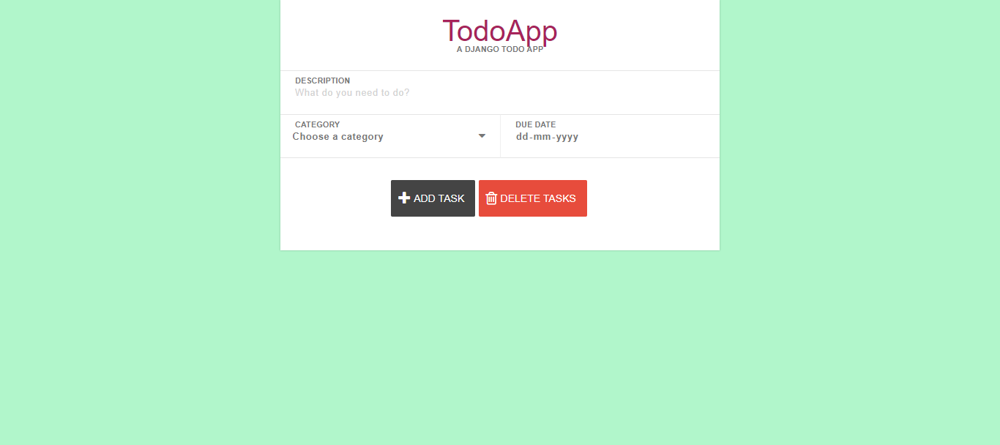
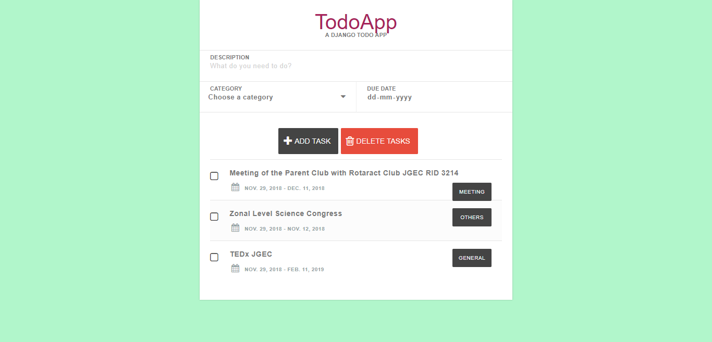

# Todo-App
> A DJANGO TODOAPP

__Creating a Todo App using Django__

## Prerequisite
> **pip install django**   
> **Text Editor** : I have used *Sublime Text* (you can use any text editor) 

- Fork this repo(button on top)  
- Clone on your local machine   
> git clone https://github.com/pydevsg/Todo-App   
> cd todoapp  
\ Location of the repository on your local machine> py manage.py createsuperuser
  - Create your own username and password  
  - -  Run **py manage.py runserver** ( This will open your page in [TodoApp - Create A Todo With Django](http://127.0.0.1:8000/)    
  > To open it in your own port _(say 9000)_ **py manage.py runserver 9000** [TodoApp - Create A Todo With Django](http://127.0.0.1:9000/) 
  - - - visit the [Admin page](http://127.0.0.1:9000/admin/) and login into your Django account and add  your own Categories and see the Lists 
## Features
- [x] ADD TASK
- [x] DELETE TASKS

# Ideas for Contribution 
- Newcomers are welcomed :smiley:
- Style the index.html
- Add more buttons such as __Edit Task__ to increase the features of TodoApp
- Update Documentation after adding new features.

## Acknowledgement
- Thanks to all the contributors :clap: :v: 
- Please add your name in the [Contributors Page](https://github.com/pydevsg/Todo-App/blob/master/CONTRIBUTORS.md) if you have contributed in this repo :raised_hands:

>  ### Author : Sudipto Ghosh
